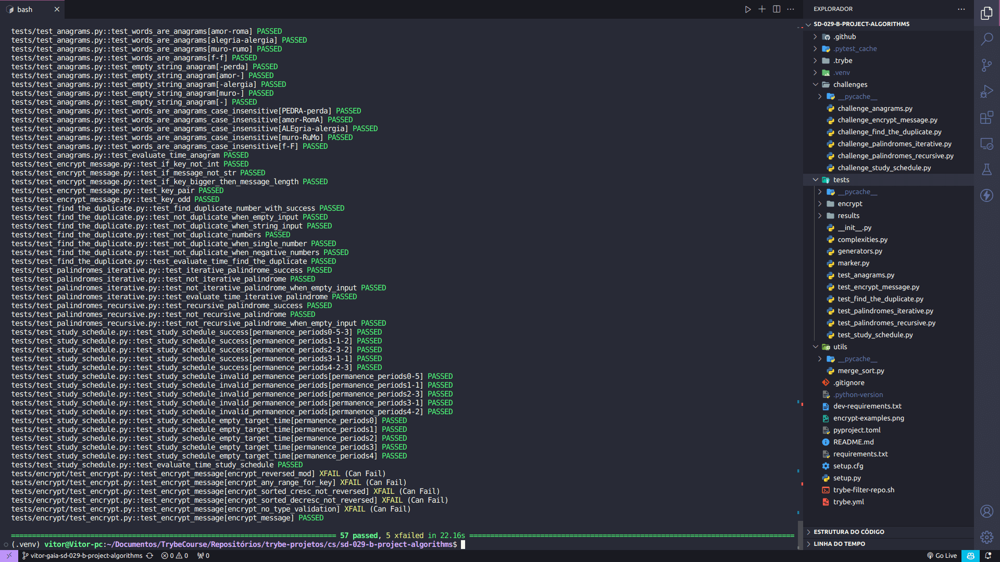
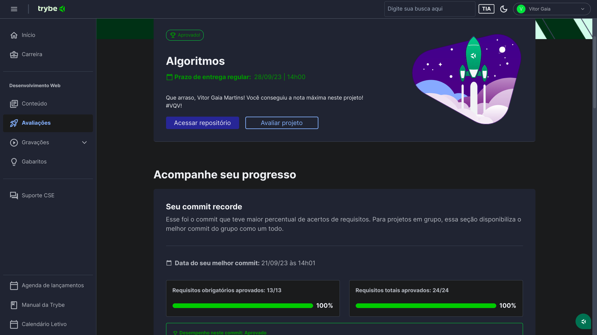

# 🔢 Algoritmos

<div align='center'>
    
</div>

## 📘 Sobre

Desafios treinando a aplicação de algoritmos de busca, ordenação, iterativos e recursivos em Python.

## 🛠️ Ferramentas

- Python
- Pytest
- Pip
- Venv

## 📝 Pré-requisitos

Antes de começar, você vai precisar ter instalado em sua máquina as seguintes ferramentas: [Python](https://www.python.org/), [Pip](https://pypi.org/project/pip/), [Venv](https://docs.python.org/3/library/venv.html).
Além disto é bom ter um editor para trabalhar com o código como [VSCode](https://code.visualstudio.com/);

## 🎮 Rodando localmente

```bash
  # Clone o projeto
  $ git clone git@github.com:vitorGaia/algorithms.git

  # Entre no diretório do projeto
  $ cd algorithms
    
  # crie e ative um ambiente virtual
  $ python3 -m venv .venv && source .venv/bin/activate

  # Instale as dependências
  $ python3 -m pip install -r dev-requirements.txt

  # Para executar um arquivo
  $ python3 challenges/nome_do_arquivo.py
```

## 🧪 Testes

```bash
  # Para executar todos os testes
  $ python3 -m pytest

  # Para executar apenas um arquivo
  $ python3 -m pytest tests/nome_do_arquivo.py
```

<div align='center'>
    
</div>

<details>
<summary style="font-size: 20px;">💡 Saiba mais</summary>

<div align='center'>
    
</div>
</details>